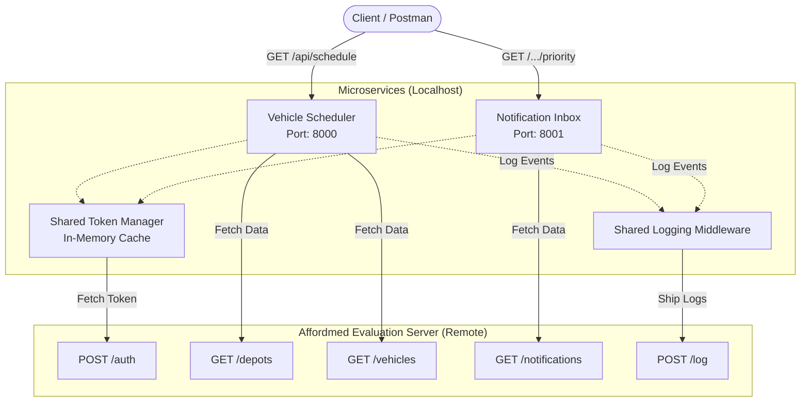

# System Design & Architecture Document

This document outlines the architectural decisions, system flow, and algorithmic complexities implemented in the Campus Notification & Vehicle Scheduling system.

## 🏗️ Architecture Diagram

## 🧠 Core Algorithms

### 1. Vehicle Maintenance Scheduler
**Problem:** Maximize total maintenance impact without exceeding the mechanic-hours budget per depot.
**Solution:** 0/1 Knapsack Algorithm using Bottom-Up Dynamic Programming.
- **Constraint mapping**: Weight = `Duration`, Value = `Impact`, Capacity = `MechanicHours`.
- **Implementation**: `vehicle_scheduling/scheduler.js`
- **Time Complexity**: $O(n \times W)$, where $n$ is the number of vehicles and $W$ is the mechanic-hour budget.
- **Space Complexity**: $O(n \times W)$ for the DP table. (Could be optimized to $O(W)$, but a 2D table is maintained to allow backtracking to identify the exact subset of vehicles selected).

### 2. Notification Priority Inbox
**Problem:** Rank thousands of notifications based on both their type and their recency, returning only the top `N`.
**Solution:** Custom Min-Heap data structure.
- **Scoring Formula**: `Score = (TypeWeight * 0.65) + (RecencyScore * 0.35)`
- **Implementation**: `notification_app_be/priorityInbox.js`
- **Why a Min-Heap?**: Sorting all notifications takes $O(k \log k)$ time. By maintaining a Min-Heap strictly at size `N`, we optimize the time complexity when `N` is much smaller than the total notification count `k`.
- **Time Complexity**: $O(k \log n)$, where $k$ is total notifications and $n$ is the requested inbox size.
- **Space Complexity**: $O(n)$ to store the top `n` elements in the heap.

## 🔐 System Reliability Features

### 1. Resilient Authentication (Token Manager)
The system utilizes a custom `tokenManager.js` that centralizes the Bearer token logic:
- **In-Memory Caching**: Tokens are cached internally to prevent spamming the external `/auth` endpoint on every request.
- **TTL Expiry**: The token proactively expires from the internal cache 14 minutes after generation (assuming standard 15-minute validity).
- **Auto-Retry (401 Interception)**: If the evaluation API unexpectedly returns an HTTP `401 Unauthorized`, the services automatically flush the cache, fetch a fresh token, and retry the request silently without crashing or exposing the error to the client.

### 2. Centralized Structured Logging
A `logging_middleware` is integrated across both microservices to ensure complete observability.
- Ensures absolute compliance with the evaluation API's strict payload formatting (`stack`, `level`, `package`, `message`).
- Uses asynchronous POST requests wrapped in `try/catch` to ensure that even if the logging API is unreachable or rate-limited, the core microservices will not crash (a bug identified and fixed during migration).

## 🚀 Design Principles Applied
- **Statelessness**: No databases are used; allowing horizontally scalable microservices.
- **Separation of Concerns**: Business logic (Knapsack/Min-Heap) is heavily decoupled from Express routing logic.
- **Graceful Error Handling**: Client responses explicitly differentiate between `internal_server_error` (Code 500) and `external_api_error` (Code 502 Bad Gateway) for rapid debugging.
